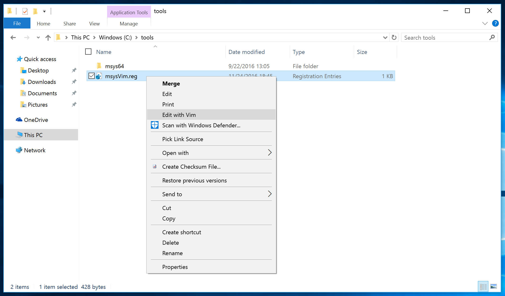
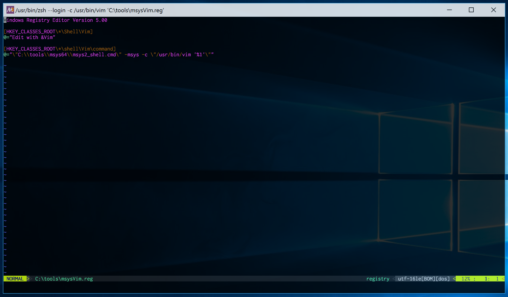

# msysVim
Add `Edit with Vim` to your Windows context menu- using vim from `msys2`.

## Install
1. Install msys2 to `c:\tools`, or adjust the registry file and batch script.
2. Import the [provided registry entry](msysVim.reg)
3. Copy msysVim to msys2's `/usr/bin`
4. Associate desired extensions with `msysVim.bat`

